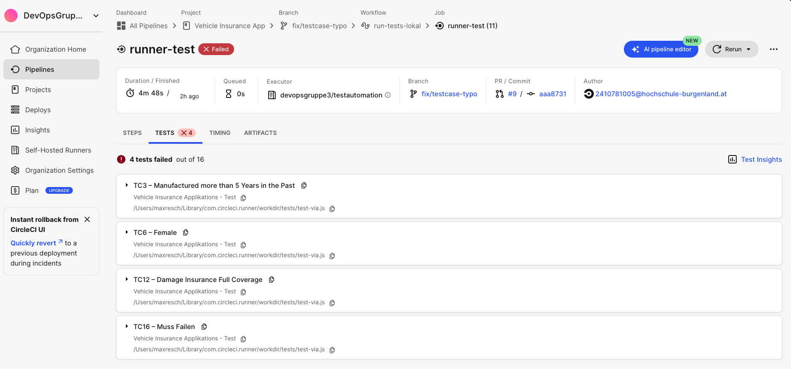

# Aufgabe Testautomation + Integration CI/CD Pipeline

Projektdokumentation von Gruppe 3 - Christoph Hiess, Maximilian Resch, Alexander Prantl für das Projekt "Testautomation einer Web App mit CircleCI und TestCafe".

## Inhalt

- Beschreibung

- Verwendete Software

- Umsetzung

- Test Cases

- Ergebnisse / Testing

- Sonstiges

## Beschreibung

Die Aufgabenstellung umfasst die Erstellung einer CI/CD Pipeline mittels CircleCI und die Ausführung der Testsoftware TestCafe zur Überprüfung der "Tricentis Vehicle Insurance App". Die CI/CD Pipeline soll die Testsoftware starten, Tests durchlaufen lassen und die Ergebnisse danach im CI/CD Portal anzeigen.

Für die Umsetzung nutzen wir die CircleCI Cloud mit einem lokalen Runner der auf einem Mac ausgeführt wird. Die Testsoftware TestCafe führt die Tests durch und generiert einen Report der am Ende der Pipeline in das CircleCI Portal hochgeladen und analysiert wird.

Als Trigger zum starten der Pipeline nutzen wir die zuweisen des Tags "run-ci" bei einem Pull-Request.

Die Testläufe werden mittels eines Templates ausgeführt das in einer Schleife alle Testcases übergibt die in der Datei "testcases.js" definiert sind. Dadurch lassen sich Änderungen an der Applikation schneller im Template umbauen und müssen nicht für alle Testcases neu geschrieben werden.

## Verwendete Software

- GitHub (Repo für die Testsoftware Scripts) https://github.com/2410781005/via-e2e-test-devops/

- CircleCI Cloud (CI/CD Piepline zur Ausführung des ganzen Testprozesses) [https://circleci.com](https://circleci.com)

- CircleCI self-hosted Runner (führt die Pipeline lokal am Gerät aus) [CircleCI’s self-hosted runner overview - CircleCI](https://circleci.com/docs/runner-overview/)

- TestCafe (Testing Software für die Web App) https://testcafe.io

## Umsetzung

Anbei die Installations und Konfigurationsschritte die nötig sind um die Test Pipeline zu erstellen.

> ⚠️ Die Anleitung bezieht sich auf die Installation auf einem macOS Gerät. Wo gerätespezifische Schritte erklärt werde, finden sich verweise auf die Anleitungen für andere Betriebssysteme

### GitHub

Auf GitHub oder einem anderen Source Code Verwaltungs Programm das mit CircleCI kompatibel ist, muss ein Repo erstellt werden (privat oder öffentlich ist beides möglich). Dieses Repo wird in dem nächsten Schritt mir CircleCI verknüpft.

### CircleCI Cloud

Auf der Webseite von CircleCI https://circleci.com einen Account erstellen und die Verifizierungsschritte durchführen. Bei der erstmaligen Registrierung wird man gleich Aufgefordert ein Projekt zu erstellen und dem Projekt ein Repo zuzuweisen. Hierbei soll das oben erstellte Repo ausgewählt werden.

Damit ist das Projekt eingerichtet, damit die Pipeline lokal auf einem Rechner ausgeführt werden kann, muss dieser installiert und konfiguriert werden.

### CircleCI self-hosted Runner

Zum konfigurieren eines self-hosted CirclCI Runners unter macOS der direkt auf der Maschine läuft, müssen folgende Schritte durchgeführt werden:

Im CircleCI Portal auf "Self-Hosted Runners" klicken und eine neue Resource Class anlegen. Die werte können frei gewählt werden, werden aber später dann für die config verwendet. Nach dem Schritt wird ein Config Code angezeigt. Dieser wird nach der Installation des Runners benötigt.

#### Runner Installieren

> ⚠️ Anleitung für andere OS Varianten: [CircleCI’s self-hosted runner overview - CircleCI](https://circleci.com/docs/runner-overview/)

Es muss Homebrew am macOS Gerät vorhanden sein

```bash
brew tap circleci-public/circleci
```

Danach den circleci-runner installieren:

```bash
brew install circleci-runner
```

Nach erfolgreicher Installation wird die config angepasst damit sich der Runner mit dem Cloud Konto verbindet

```bash
nano $HOME/Library/Preferences/com.circleci.runner/config.yaml
```

In dieser Datei muss der **name** des Runners eingetragen werden und der **auth_token** angepasst werden.

Nun sieht die Datei so ähnliche wie diese aus:

```context
runner:
  name: "mac-mini-runner"
  working_directory: "/Users/maxresch/Library/com.circleci.runner/workdir"
  cleanup_working_directory: true
api:
  auth_token: "XXXXXX-94d69630b24da349727f178ba01517d7fee15ea958d8873d1"
```

Jetzt kommen spezifische Kommandos das der Mac den Runner ausführen darf

```bash
spctl -a -vvv -t install "$(brew --prefix)/bin/circleci-runner"
```

```bash
sudo xattr -r -d com.apple.quarantine "$(brew --prefix)/bin/circleci-runner"
```

Mit den nächsten Schritten wird der Runner Service enabled

```bash
launchctl bootstrap gui/$(id -u) $HOME/Library/LaunchAgents/com.circleci.runner.plist
launchctl enable gui/$(id -u)/com.circleci.runner
launchctl kickstart -k gui/$(id -u)/com.circleci.runner
```

Mittels dem folgenden Befehl kann überprüft werden ob der Runner läuft

```bash
launchctl print gui/$(id -u)/com.circleci.runne
```

In der config von CircleCi muss noch die **resource class** an die oben erstellte angepasst werden. Die Datei befindet sich im Git und heißt "circleci/config.yml"

```yml
version: 2.1

jobs:
  runner-test:
    machine: true
    resource_class: <ANPASSEN!!! z.B. devopsgruppe3/testautomation>
    steps:
      - checkout

      - run:
          name: Node.js install pruefen
          command: |
            node -v
            npm -v

      - run:
          name: TestCafe Tests ausführen
          command: |
            npx testcafe chrome tests/test-via.js -r xunit:report/test-results/testcafe/results.xml 

      - store_test_results:
          path: report/test-results/testcafe/
      - store_artifacts:
          path: report/test-results/testcafe/

workflows:
  run-tests-lokal:
    jobs:
      - runner-test
```

Ab jetzt ist die CircleCI Pipeline und der Runner funktionsfähig. Im nächsten Punkt wird die Erstellung der TestCafe Datei erklärt, damit die Pipeline gestartet werden kann.

### TestCafe

Zum installieren von TestCafe muss Node und npm auf dem Gerät installiert sein.

Mit diesem Befehl wird TestCafe installiert

```bash
npm install -g testcafe
```

Zur Report Erstellung und Übermittlung an CircleCI muss xunit tusätzlich installiert werden

```bash
npm install testcafe-reporter-xunit
```

Mittels der Debug Funktion von TestCafe lassen sich die Elemente und dessen ID's sehr leicht ermitteln und in das Testscript einbauen.

Dafür muss jedes formular Feld angeklickt und ausgefüllt und der ganze Prozess einmal manuell durchgegangen werden.

In der Datei "test/test-via.js" befinden sich die Variablen der Elemente und der eigentliche Testablauf.

Die Pipeline ruft den TestCafe Befehl auf der dieses Script Schritt für Schritt durchgeht. In einer Schleife werden alle definierten Test Cases nacheinander abgearbeitet.

## Test Cases

| StraightThrough         |                                  |
| ----------------------- | -------------------------------- |
| Attributes              | value                            |
| Engine Performance [kW] | 500                              |
| Date of Manufacture     | {Date[][-3y][MM'/'dd'/'yyyy]}    |
| Number of Seats         | 5                                |
| Fuel Type               | Petrol                           |
| List Price              | 20000                            |
| Annual Mileage          | 50000                            |
| Age                     | 26                               |
| Gender                  | Male                             |
| Country                 | United States                    |
| Occupation              | Employee                         |
| Preferred Start Date    | {DATE[][+1M+1d][MM'/'dd'/'yyyy]} |
| Insurance Sum           | 7.000.000,00                     |
| Merit Rating            | Bonus 5                          |
| Damage Insurance        | Partial Coverage                 |
| Euro Protection         | FALSCH                           |
| Legal Defense Insurance | WAHR                             |
| Courtesy Car Option     | No                               |
| Price Silver            | 331.00                           |
| Price Gold              | 977.00                           |
| Price Platinum          | 1,917.00                         |
| Price Ultimate          | 3,652.00                         |

| Engine performance between 1000 and 2000 |                                  |
| ---------------------------------------- | -------------------------------- |
| Attributes                               | value                            |
| Engine Performance [kW]                  | 1500                             |
| Date of Manufacture                      | {Date[][-3y][MM'/'dd'/'yyyy]}    |
| Number of Seats                          | 5                                |
| Fuel Type                                | Petrol                           |
| List Price                               | 20000                            |
| Annual Mileage                           | 50000                            |
| Age                                      | 26                               |
| Gender                                   | Male                             |
| Country                                  | United States                    |
| Occupation                               | Employee                         |
| Preferred Start Date                     | {DATE[][+1M+1d][MM'/'dd'/'yyyy]} |
| Insurance Sum                            | 7.000.000,00                     |
| Merit Rating                             | Bonus 5                          |
| Damage Insurance                         | Partial Coverage                 |
| Euro Protection                          | FALSCH                           |
| Legal Defense Insurance                  | WAHR                             |
| Courtesy Car Option                      | No                               |
| Price Silver                             | 337.00                           |
| Price Gold                               | 993.00                           |
| Price Platinum                           | 1,949.00                         |
| Price Ultimate                           | 3,712.00                         |

| Manufactured more than 5 Years in the Past |                                  |
| ------------------------------------------ | -------------------------------- |
| Attributes                                 | value                            |
| Engine Performance [kW]                    | 500                              |
| Date of Manufacture                        | {Date[][-10y][MM'/'dd'/'yyyy]}   |
| Number of Seats                            | 5                                |
| Fuel Type                                  | Petrol                           |
| List Price                                 | 20000                            |
| Annual Mileage                             | 50000                            |
| Age                                        | 26                               |
| Gender                                     | Male                             |
| Country                                    | United States                    |
| Occupation                                 | Employee                         |
| Preferred Start Date                       | {DATE[][+1M+1d][MM'/'dd'/'yyyy]} |
| Insurance Sum                              | 7.000.000,00                     |
| Merit Rating                               | Bonus 5                          |
| Damage Insurance                           | Partial Coverage                 |
| Euro Protection                            | FALSCH                           |
| Legal Defense Insurance                    | WAHR                             |
| Courtesy Car Option                        | No                               |
| Price Silver                               | 334.00                           |
| Price Gold                                 | 983.00                           |
| Price Platinum                             | 1,931.00                         |
| Price Ultimate                             | 3,678.00                         |

| List price between 50K and 100K |                                  |
| ------------------------------- | -------------------------------- |
| Attributes                      | value                            |
| Engine Performance [kW]         | 500                              |
| Date of Manufacture             | {Date[][-3y][MM'/'dd'/'yyyy]}    |
| Number of Seats                 | 5                                |
| Fuel Type                       | Petrol                           |
| List Price                      | 75000                            |
| Annual Mileage                  | 50000                            |
| Age                             | 26                               |
| Gender                          | Male                             |
| Country                         | United States                    |
| Occupation                      | Employee                         |
| Preferred Start Date            | {DATE[][+1M+1d][MM'/'dd'/'yyyy]} |
| Insurance Sum                   | 7.000.000,00                     |
| Merit Rating                    | Bonus 5                          |
| Damage Insurance                | Partial Coverage                 |
| Euro Protection                 | FALSCH                           |
| Legal Defense Insurance         | WAHR                             |
| Courtesy Car Option             | No                               |
| Price Silver                    | 466.00                           |
| Price Gold                      | 1,374.00                         |
| Price Platinum                  | 2,697.00                         |
| Price Ultimate                  | 5,137.00                         |

| Age between 18 an 25    |                                  |
| ----------------------- | -------------------------------- |
| Attributes              | value                            |
| Engine Performance [kW] | 500                              |
| Date of Manufacture     | {Date[][-3y][MM'/'dd'/'yyyy]}    |
| Number of Seats         | 5                                |
| Fuel Type               | Petrol                           |
| List Price              | 20000                            |
| Annual Mileage          | 50000                            |
| Age                     | 21                               |
| Gender                  | Male                             |
| Country                 | United States                    |
| Occupation              | Employee                         |
| Preferred Start Date    | {DATE[][+1M+1d][MM'/'dd'/'yyyy]} |
| Insurance Sum           | 7.000.000,00                     |
| Merit Rating            | Bonus 5                          |
| Damage Insurance        | Partial Coverage                 |
| Euro Protection         | FALSCH                           |
| Legal Defense Insurance | WAHR                             |
| Courtesy Car Option     | No                               |
| Price Silver            | 331.00                           |
| Price Gold              | 977.00                           |
| Price Platinum          | 1,917.00                         |
| Price Ultimate          | 3,652.00                         |

| Age between 56 and 70   |                                  |
| ----------------------- | -------------------------------- |
| Attributes              | value                            |
| Engine Performance [kW] | 500                              |
| Date of Manufacture     | {Date[][-3y][MM'/'dd'/'yyyy]}    |
| Number of Seats         | 5                                |
| Fuel Type               | Petrol                           |
| List Price              | 20000                            |
| Annual Mileage          | 50000                            |
| Age                     | 62                               |
| Gender                  | Male                             |
| Country                 | United States                    |
| Occupation              | Employee                         |
| Preferred Start Date    | {DATE[][+1M+1d][MM'/'dd'/'yyyy]} |
| Insurance Sum           | 7.000.000,00                     |
| Merit Rating            | Bonus 5                          |
| Euro Protection         | FALSCH                           |
| Damage Insurance        |                                  |
| Legal Defense Insurance | WAHR                             |
| Courtesy Car Option     | No                               |
| Price Silver            | 331.00                           |
| Price Gold              | 977.00                           |
| Price Platinum          | 1,917.00                         |
| Price Ultimate          | 3,652.00                         |

| Female                  |                                  |
| ----------------------- | -------------------------------- |
| Attributes              | value                            |
| Engine Performance [kW] | 500                              |
| Date of Manufacture     | {Date[][-3y][MM'/'dd'/'yyyy]}    |
| Number of Seats         | 5                                |
| Fuel Type               | Petrol                           |
| List Price              | 20000                            |
| Annual Mileage          | 50000                            |
| Age                     | 26                               |
| Gender                  | Female                           |
| Country                 | United States                    |
| Occupation              | Employee                         |
| Preferred Start Date    | {DATE[][+1M+1d][MM'/'dd'/'yyyy]} |
| Insurance Sum           | 7.000.000,00                     |
| Merit Rating            | Bonus 5                          |
| Damage Insurance        | Partial Coverage                 |
| Euro Protection         | FALSCH                           |
| Legal Defense Insurance | WAHR                             |
| Courtesy Car Option     | No                               |
| Price Silver            | 331.00                           |
| Price Gold              | 947.00                           |
| Price Platinum          | 1,917.00                         |
| Price Ultimate          | 3,652.00                         |

| Start date month after next month |                                  |
| --------------------------------- | -------------------------------- |
| Attributes                        | value                            |
| Engine Performance [kW]           | 500                              |
| Date of Manufacture               | {Date[][-3y][MM'/'dd'/'yyyy]}    |
| Number of Seats                   | 5                                |
| Fuel Type                         | Petrol                           |
| List Price                        | 20000                            |
| Annual Mileage                    | 50000                            |
| Age                               | 26                               |
| Gender                            | Male                             |
| Country                           | United States                    |
| Occupation                        | Employee                         |
| Preferred Start Date              | {DATE[][+2M+1d][MM'/'dd'/'yyyy]} |
| Insurance Sum                     | 7.000.000,00                     |
| Merit Rating                      | Bonus 5                          |
| Damage Insurance                  | Partial Coverage                 |
| Euro Protection                   | FALSCH                           |
| Legal Defense Insurance           | WAHR                             |
| Courtesy Car Option               | No                               |
| Price Silver                      | 331.00                           |
| Price Gold                        | 977.00                           |
| Price Platinum                    | 1,917.00                         |
| Price Ultimate                    | 3,652.00                         |

| Insuarance sum between 15M and 35M |                                  |
| ---------------------------------- | -------------------------------- |
| Attributes                         | value                            |
| Engine Performance [kW]            | 500                              |
| Date of Manufacture                | {Date[][-3y][MM'/'dd'/'yyyy]}    |
| Number of Seats                    | 5                                |
| Fuel Type                          | Petrol                           |
| List Price                         | 20000                            |
| Annual Mileage                     | 50000                            |
| Age                                | 26                               |
| Gender                             | Male                             |
| Country                            | United States                    |
| Occupation                         | Employee                         |
| Preferred Start Date               | {DATE[][+1M+1d][MM'/'dd'/'yyyy]} |
| Insurance Sum                      | 25.000.000,00                    |
| Merit Rating                       | Bonus 5                          |
| Damage Insurance                   | Partial Coverage                 |
| Euro Protection                    | FALSCH                           |
| Legal Defense Insurance            | WAHR                             |
| Courtesy Car Option                | No                               |
| Price Silver                       | 338.00                           |
| Price Gold                         | 995.00                           |
| Price Platinum                     | 1,953.00                         |
| Price Ultimate                     | 3,721.00                         |

| Merit Rating Super Bonus |                                  |
| ------------------------ | -------------------------------- |
| Attributes               | value                            |
| Engine Performance [kW]  | 500                              |
| Date of Manufacture      | {Date[][-3y][MM'/'dd'/'yyyy]}    |
| Number of Seats          | 5                                |
| Fuel Type                | Petrol                           |
| List Price               | 20000                            |
| Annual Mileage           | 50000                            |
| Age                      | 26                               |
| Gender                   | Male                             |
| Country                  | United States                    |
| Occupation               | Employee                         |
| Preferred Start Date     | {DATE[][+1M+1d][MM'/'dd'/'yyyy]} |
| Insurance Sum            | 7.000.000,00                     |
| Merit Rating             | Super Bonus                      |
| Damage Insurance         | Partial Coverage                 |
| Euro Protection          | FALSCH                           |
| Legal Defense Insurance  | WAHR                             |
| Courtesy Car Option      | No                               |
| Price Silver             | 322.00                           |
| Price Gold               | 948.00                           |
| Price Platinum           | 1,861.00                         |
| Price Ultimate           | 3,546.00                         |

| Merit Rating malus between 10 and 17 |                                  |
| ------------------------------------ | -------------------------------- |
| Attributes                           | value                            |
| Engine Performance [kW]              | 500                              |
| Date of Manufacture                  | {Date[][-3y][MM'/'dd'/'yyyy]}    |
| Number of Seats                      | 5                                |
| Fuel Type                            | Petrol                           |
| List Price                           | 20000                            |
| Annual Mileage                       | 50000                            |
| Age                                  | 26                               |
| Gender                               | Male                             |
| Country                              | United States                    |
| Occupation                           | Employee                         |
| Preferred Start Date                 | {DATE[][+1M+1d][MM'/'dd'/'yyyy]} |
| Insurance Sum                        | 7.000.000,00                     |
| Merit Rating                         | Malus 13                         |
| Damage Insurance                     | Partial Coverage                 |
| Euro Protection                      | FALSCH                           |
| Legal Defense Insurance              | WAHR                             |
| Courtesy Car Option                  | No                               |
| Price Silver                         | 370.00                           |
| Price Gold                           | 1,090.00                         |
| Price Platinum                       | 2,141.00                         |
| Price Ultimate                       | 4,078.00                         |

| Damage Insurance No Coverage |                                  |
| ---------------------------- | -------------------------------- |
| Attributes                   | value                            |
| Engine Performance [kW]      | 500                              |
| Date of Manufacture          | {Date[][-3y][MM'/'dd'/'yyyy]}    |
| Number of Seats              | 5                                |
| Fuel Type                    | Petrol                           |
| List Price                   | 20000                            |
| Annual Mileage               | 50000                            |
| Age                          | 26                               |
| Gender                       | Male                             |
| Country                      | United States                    |
| Occupation                   | Employee                         |
| Preferred Start Date         | {DATE[][+1M+1d][MM'/'dd'/'yyyy]} |
| Insurance Sum                | 7.000.000,00                     |
| Merit Rating                 | Bonus 5                          |
| Damage Insurance             | No Coverage                      |
| Euro Protection              | FALSCH                           |
| Legal Defense Insurance      | WAHR                             |
| Courtesy Car Option          | No                               |
| Price Silver                 | 282.00                           |
| Price Gold                   | 832.00                           |
| Price Platinum               | 1,634.00                         |
| Price Ultimate               | 3,112.00                         |

| Damage Insurance Full Coverage |                                  |
| ------------------------------ | -------------------------------- |
| Attributes                     | value                            |
| Engine Performance [kW]        | 500                              |
| Date of Manufacture            | {Date[][-3y][MM'/'dd'/'yyyy]}    |
| Number of Seats                | 5                                |
| Fuel Type                      | Petrol                           |
| List Price                     | 20000                            |
| Annual Mileage                 | 50000                            |
| Age                            | 26                               |
| Gender                         | Male                             |
| Country                        | United States                    |
| Occupation                     | Employee                         |
| Preferred Start Date           | {DATE[][+1M+1d][MM'/'dd'/'yyyy]} |
| Insurance Sum                  | 7.000.000,00                     |
| Merit Rating                   | Bonus 5                          |
| Damage Insurance               | Full Coverage                    |
| Euro Protection                | FALSCH                           |
| Legal Defense Insurance        | WAHR                             |
| Courtesy Car Option            | No                               |
| Price Silver                   | 348.00                           |
| Price Gold                     | 1,024.00                         |
| Price Platinum                 | 2,017.00                         |
| Price Ultimate                 | 3,841.00                         |

| Euro Protection         |                                  |
| ----------------------- | -------------------------------- |
| Attributes              | value                            |
| Engine Performance [kW] | 500                              |
| Date of Manufacture     | {Date[][-3y][MM'/'dd'/'yyyy]}    |
| Number of Seats         | 5                                |
| Fuel Type               | Petrol                           |
| List Price              | 20000                            |
| Annual Mileage          | 50000                            |
| Age                     | 26                               |
| Gender                  | Male                             |
| Country                 | United States                    |
| Occupation              | Employee                         |
| Preferred Start Date    | {DATE[][+1M+1d][MM'/'dd'/'yyyy]} |
| Insurance Sum           | 7.000.000,00                     |
| Merit Rating            | Bonus 5                          |
| Damage Insurance        | Partial Coverage                 |
| Euro Protection         | WAHR                             |
| Legal Defense Insurance | WAHR                             |
| Courtesy Car Option     | No                               |
| Price Silver            | 333.00                           |
| Price Gold              | 981.00                           |
| Price Platinum          | 1,927.00                         |
| Price Ultimate          | 3,670.00                         |

| Optional Products_3     |                                  |
| ----------------------- | -------------------------------- |
| Attributes              | value                            |
| Engine Performance [kW] | 500                              |
| Date of Manufacture     | {Date[][-3y][MM'/'dd'/'yyyy]}    |
| Number of Seats         | 5                                |
| Fuel Type               | Petrol                           |
| List Price              | 20000                            |
| Annual Mileage          | 50000                            |
| Age                     | 26                               |
| Gender                  | Male                             |
| Country                 | United States                    |
| Occupation              | Employee                         |
| Preferred Start Date    | {DATE[][+1M+1d][MM'/'dd'/'yyyy]} |
| Insurance Sum           | 7.000.000,00                     |
| Merit Rating            | Bonus 5                          |
| Damage Insurance        | Partial Coverage                 |
| Euro Protection         | WAHR                             |
| Legal Defense Insurance | FALSCH                           |
| Courtesy Car Option     | No                               |
| Price Silver            | 283.00                           |
| Price Gold              | 833.00                           |
| Price Platinum          | 1,636.00                         |
| Price Ultimate          | 3,117.00                         |

| Courtesy Car            |                                  |
| ----------------------- | -------------------------------- |
| Attributes              | value                            |
| Engine Performance [kW] | 500                              |
| Date of Manufacture     | {Date[][-3y][MM'/'dd'/'yyyy]}    |
| Number of Seats         | 5                                |
| Fuel Type               | Petrol                           |
| List Price              | 20000                            |
| Annual Mileage          | 50000                            |
| Age                     | 26                               |
| Gender                  | Male                             |
| Country                 | United States                    |
| Occupation              | Employee                         |
| Preferred Start Date    | {DATE[][+1M+1d][MM'/'dd'/'yyyy]} |
| Insurance Sum           | 7.000.000,00                     |
| Merit Rating            | Bonus 5                          |
| Damage Insurance        | Partial Coverage                 |
| Euro Protection         | FALSCH                           |
| Legal Defense Insurance | WAHR                             |
| Courtesy Car Option     | Yes                              |
| Price Silver            | 342.00                           |
| Price Gold              | 1,009.00                         |
| Price Platinum          | 1,980.00                         |
| Price Ultimate          | 3,772.00                         |

## Ergebnisse / Testing

Die Ergebnisse lassen sich danach in dem CircleCI Portal genauer analysieren.

Jede Ausfürhung der Pipeline wird dokumentiert und die Reports die TestCafe erstellt hat, sind darin erischtlich.


